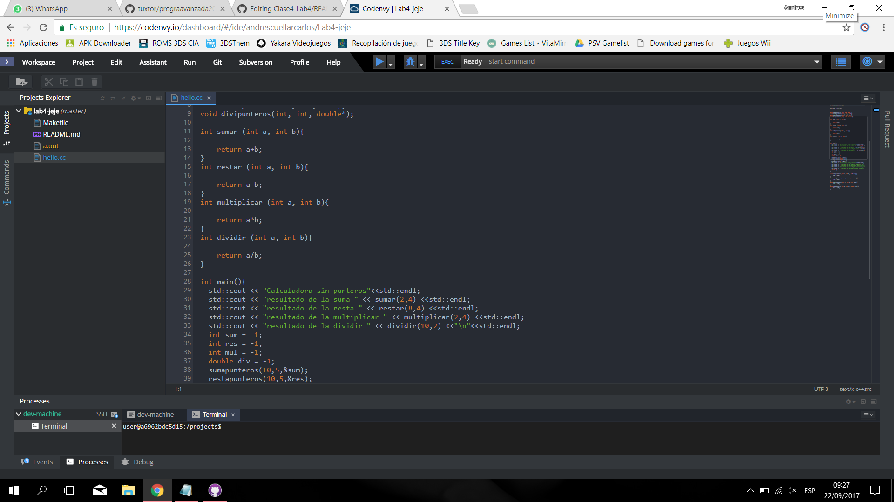
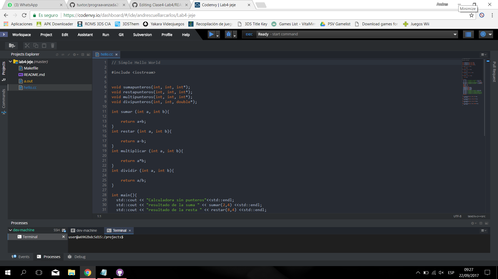
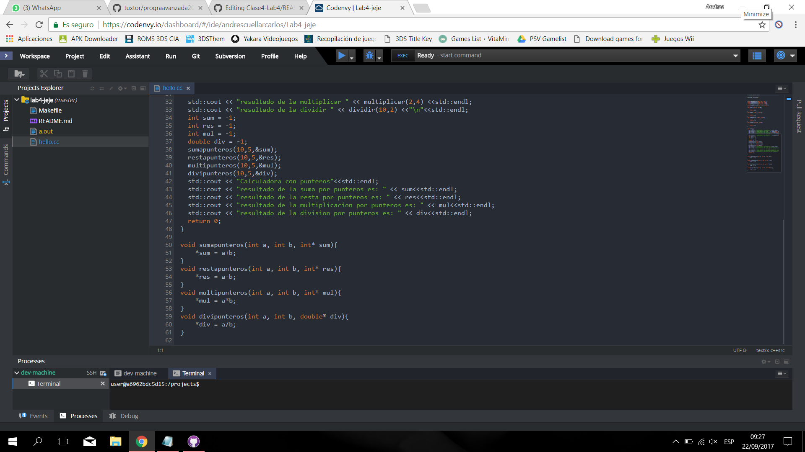

# Laboratorio 4 Programación Avanzada

### Carlos Andrés Cuéllar Velásquez 2497117
       
## a) Bitácora

1. Se crean los distintos metodos de las 4 operaciones aritmeticas.

   1.1 Se crea el metodo sumar, se dan parametros a y b y se retorna la operacion a+b.
   
   1.2 Se crea el metodo restar, se dan parametros a y b y se retorna la operacion a-b.
   
   1.3 Se crea el metodo multiplicar, se dan parametros a y b y se retorna la operacion a*b.
   
   1.4 Se crea el metodo division, se dan parametros a y b y se retorna la operacion a/b.
   
   1.5 Se crea la clase Main y se llama a los siguientes metodos para la impresion

 

 
2. Se crean los distintos metodos de las 4 operaciones aritmeticas con su respectivo puntero.

   2.1 Se declaran las funciones aritmeticas en las primeras lineas para poder usar el metodo abajo del main.
   
   2.2 Se crea el metodo sumar, se dan parametros a y b, con el puntero sum que tendra a+b.
   
   2.3 Se crea el metodo restar, se dan parametros a y b, con el puntero res que tendra a-b.
   
   2.4  Se crea el metodo multiplicar, se dan parametros a y b, con el puntero mul que tendra a*b.
   
   2.5  Se crea el metodo dividir, se dan parametros a y b, con el puntero div que tendra a/b.
   
   2.6 En la clase Main se imprimen los distintos punteros con las respuestas con todos los resultados.

 
 
 
